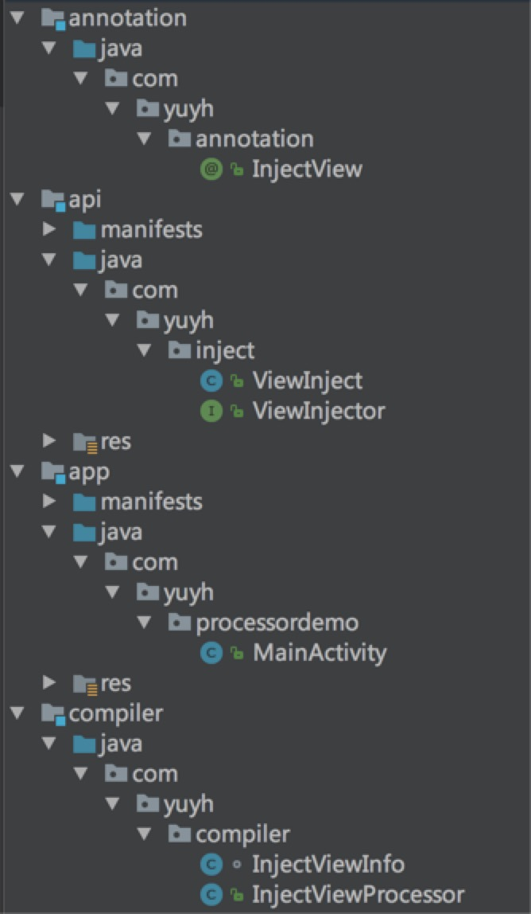

# ProcessorDemo

Android annotation-processor demo.

## 反射(Reflection)

- JAVA反射机制，指在“运行状态”下，
	- 对于任意一个类，都能够知道这个类的所有属性和方法；
	- 对于任意一个对象，都能够调用它的任意一个方法和属性；
- Java反射机制主要提供了几个功能：
	- 在运行时判断任意一个对象所属的类：```obj.getClass()```
	- 在运行时构造任意一个类的对象：```getClass().newInstance()```
	- 在运行时判断任意一个类所具有的成员变量和方法：```getClass().getDeclaredFields()```、```getDeclaredMethods()```
	- 在运行时调用任意一个对象的方法：```method.invoke(obj, params…)```
	- 在运行时为任意一个属性赋值：```field.set(obj, value)```

### Class 对象

- .class 文件在程序运行时会被 ClassLoader 加载到虚拟机中；
- 当一个类被加载以后，JVM就会在内存中自动产生一个 Class 对象，通过它能够获悉整个类的结构。

```java
/**
 * 获取Class对象的三种方式
 */
public void Class<?> getClassObj() {
    // 根据类名获取Class对象
    Class<?> clazz1 = Book.class;

    // 根据对象获取Class对象
    Book book = new Book();
    Class<?> clazz2 = people.getClass();

    // 根据完整类名获取Class对象
    try {
        Class<?> clazz3 = Class.forName(“com.yuyh.demo.Book”);
    } catch (ClassNotFoundException e) {
    }

    return clazz1; // clazz2 clazz3
}
```

### 构造实例

```java
/**
 * 调用类的构造函数
 */
public static Object getObject() {
    try {
        // 获取类的Class对象
        Class<?> clz = getClassObj();
        // 获取类对象的Constructor
        Constructor<?> constructor = clz.getConstructor(String.class, int.class, String.class);
        // 在使用时取消private权限检查
        constructor.setAccessible(true);
        // 通过 Constructor 来创建对象
        Object obj = constructor.newInstance(“xxxx”, 3, “pppp”);

        return obj;
    } catch (Exception e) {
    }
    return null;
}
```

### 方法调用

```java
public void getDeclaredMethods() {
    Book book = (Book) getObject();
    // 获取到类中的所有方法(不包含从父类继承的方法)
    Method[] methods = book.getClass().getDeclaredMethods();
    for (int i = 0; i < methods.length; i++) {
        Log.i(TAG, "method[" + i + "] = " + methods[i].getName());
    }

    try {
        // 获取类中的某个方法
        Method method = book.getClass().getDeclaredMethod("setAuthor", String.class);
        // 判断是否是public方法
        Modifier.isPublic(method.getModifiers());
        Modifier.isPrivate(method.getModifiers());
        Modifier.isProtected(method.getModifiers());
        // 获取该方法的参数类型列表
        Parameter[] paramTypes = method.getParameters();

        Log.i(TAG, "befor= " + book.getAuthor());

        method.invoke(book, "yyh"); // 执行该方法

        Log.i(TAG, "after= " + book.getAuthor());
    } catch (Exception e) {
        Log.e(TAG, e.toString());
    }
}
```

### 属性赋值

```java
public void voitDeclaredFields() {
    Book book = (Book) getObject();
    // 获取所有属性，不包括父类
    Field[] fields = book.getClass().getDeclaredFields();
    for (int i = 0; i < fields.length; i++) {
        Log.i(TAG, "fields[" + i + "] = " + fields[i].getName());
    }

    try {
        // 获取当前类的某个属性
        Field field = book.getClass().getDeclaredField("author");
        // 获取属性值
        Log.i(TAG, "before = " + field.get(book));

        // 设置属性值
        field.set(book, "yuyh");

        Log.i(TAG, "after = " + field.get(book));
    } catch (Exception e) {
        e.printStackTrace();
    }
}
```

### 获取父类或接口

```java
/**
 * 获取对象的父类
 */
public static void getSuperClass() {
    Book book = new Book();
    Class<?> superClass = book.getClass().getSuperclass();
    while (superClass != null) {
        Log.i(TAG, "superClass = " + superClass.getName());
        superClass = superClass.getSuperclass(); // 循环获取上一层父类（如果存在）,至少存在一层java.lang.Object
    }
}

/**
 * 获取对象实现的接口
 */
public static void getInterface() {
    // 获取该类实现的所有接口
    Class<?>[] interfaces = Book.class.getInterfaces();
    for (int i = 0; i < interfaces.length; i++) {
        Log.i(TAG, "interfaces[" + i + "] = " + interfaces[i].getName());
    }
}
```

## 注解(Annotation)

- 注解 — 相当于某种标记，添加注解相当于为程序的某个地方打上一个标记。那么，程序从源代码到编译再到运行的各个阶段，可以去获取某个位置是否有这个标记，若有的话，就去执行相应的事情。

- 注解位置
	- 类
	- 方法，方法参数
	- 属性
- 注解分类
	- 元注解
	- 內建注解
	- 自定义注解

### 元注解

元注解表示注解在其他注解之上的注解，Java中有四个元注解，分别是：

- ```@Documented``` — 表示该类型的注解应该被 javadoc工具记录。默认情况下，javadoc生成文档是不包括注解的。
- ```@Target``` — 表示该类型的注解可以注解的程序元素的范围。包括TYPE, METHOD, CONSTRUCTOR, FIELD 等。
- ```@Inherited``` — 表示该类型的注解是否可以被继承。
- ```@Retention``` — 表示该类型的注解会被保留到那个阶段。
	- ```RetentionPolicy.SOURCE``` — 源代码保留，编译时将会忽略
	- ```RetentionPolicy.CLASS``` — 编译时保留，存在于.class文件，通过ClassLoader向内存中加载字节码文件时候，JVM会去掉相应的注解。
	- ```RetentionPolicy.RUNTIME``` — 运行时保留，存在于字节码，可通过反射调用

### 內建注解

內建注解可以认为jdk提供的几个注解，分别是

- ```@Override``` — 覆盖重写父类的方法
- ```@Deprecated``` — 方法过时标记
- ```@SurppressWarnings``` — 忽略警告
	- 例如：@SuppressWarnings({ 'unchecked', 'deprecation' })

### 自定义注解

用 @interface 标识

示例1：

```java
// 1. 定义注解
@IntDef({
        HttpMethod.GET,
        HttpMethod.POST,
        HttpMethod.PUT,
        HttpMethod.DELETE
})
@Target({ElementType.PARAMETER}) // 只能作用在参数上
@Retention(RetentionPolicy.SOURCE) // 源代码级别
public @interface HttpMethod {
    int GET = 0;
    int POST = 1;
    int PUT = 2;
    int DELETE = 3;
}

// 2. 方法参数用@HttpMethod注解，用于传参约束
public void execute(@HttpMethod int method, Map<String,String> params){ … }

// 3. 调用时传参
execute(HttpMethod.GET, null);
```

示例2：

```java
// 1. 定义注解
@Target(ElementType.FIELD) // 作用在属性上
@Retention(RetentionPolicy.RUNTIME) // 运行时生效，可通过反射获取
public @interface Column {

    boolean nullable() default false;
}

// 2. 属性用@Column注解
@Column(nullable = true)
protected String cover;

// 3. 反射调用
try {
    Field field = getClass().getField(“cover");
if (field.isAnnotationPresent(Column.class)) { // 判断是否有该注解
    Column col = field.getAnnotation(Column.class);// 获取注解
    boolean canBeNull = col.nullable();
    if (!canBeNull) {
        // do something
    }
}
} catch (Exception e) {
    e.printStackTrace();
}
```

## 注解处理器

- 在编译时扫描和处理注解
- 辅助生成Java代码
- android-apt、AnnotationProcessor
	- android-apt只支持javac编译
	- annotationProcessor既支持javac同时也支持jack(jdk8)编译。
- 最终编译出来的apk，不包含注解处理器的代码



**Element 元素：**

- PackageElement：包
- TypeElement：类
- VariableElement：类里面的属性
- ExecutableElement：类里面的方法

**案例：** View注入处理过程实现，具体详见项目代码！

- (1) 获取程序所有使用 @InjectView 注解的集合：roundEnv.getElementsAnnotatedWith(InjectView.class);
- (2) 遍历 Element 集合
- (3) 获取包名： String packageName = mElementUtils.getPackageOf(element).getQualifiedName().toString();
- (4) 获取全类名：String enclosingName = (TypeElement) element.getEnclosingElement().getQualifiedName().toString();
- (5) 获取属性类型：TypeMirror fieldType = element.asType();
- (6) 获取属性名称：String fieldName = element.getSimpleName().toString();
- (7) 通过注解获取ViewId值：int id = element.getAnnotation(InjectView.class).value();
- (8) 以类名做区分，把 Element 归类，也就是每个有用到该注解的类对应一个 List<Element>
- (9) 对这些用到注解的类，生成一个依赖注入类，并添加 findViewById 相关代码